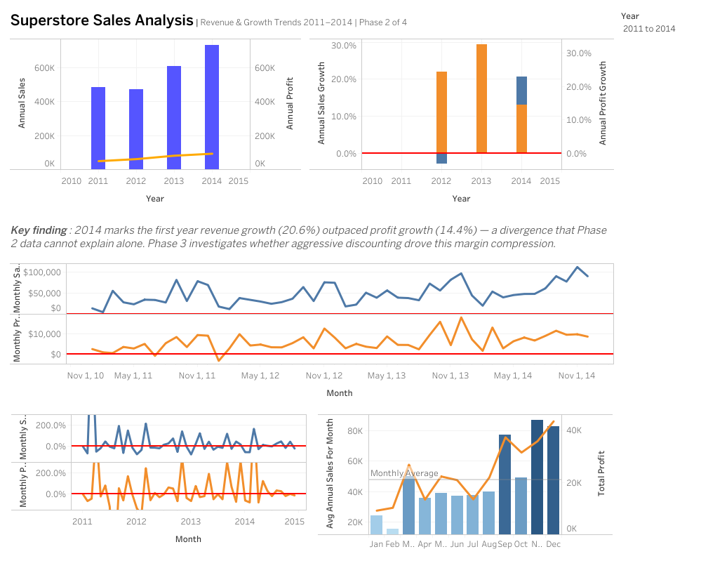
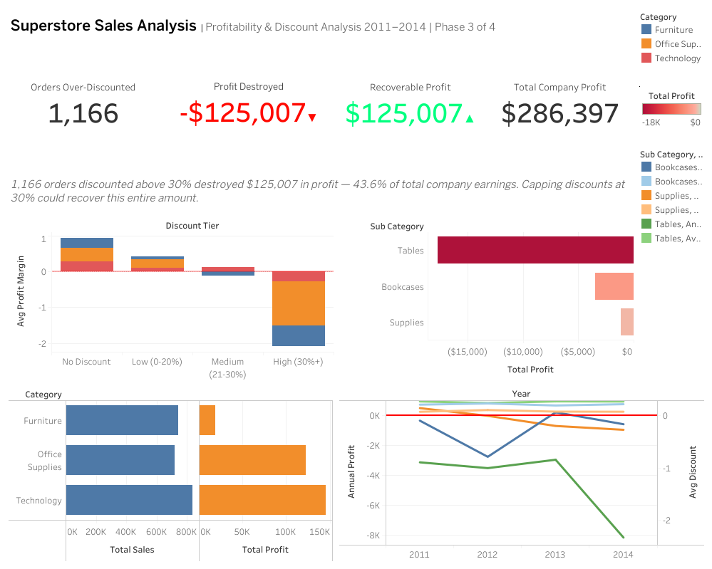
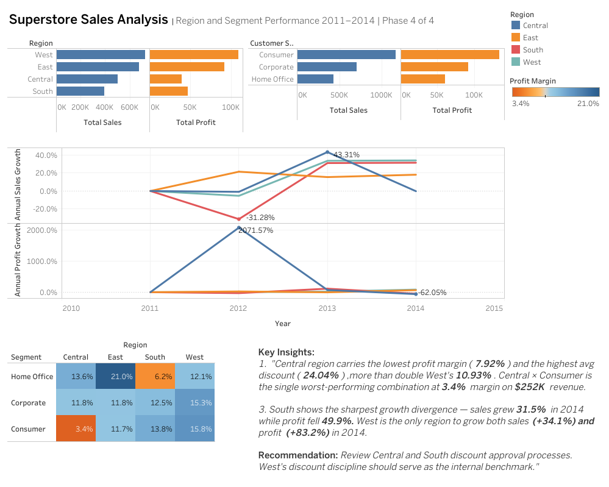

# Data Visualizations

This folder contains screenshots of the three Tableau dashboards built for the **Superstore Sales EDA** project. All dashboards were designed in Tableau Desktop and published as a connected Story on Tableau Public.

**🔗 View the live interactive dashboard:**
[Superstore Sales EDA — Full Analysis on Tableau Public](https://public.tableau.com/views/Sales_Performance_EDAv_2_2_4/SuperstoreSalesEDAFullAnalysis?:language=en-US&:sid=&:redirect=auth&:display_count=n&:origin=viz_share_link)

> The interactive version includes live filters, hover tooltips, and full story navigation. The screenshots below are static previews only.

---

## Dashboard 1 — Revenue & Growth Trends
`D1_Revenue_&_Growth_Trends.png`

**Phase 2 of 4 | Source: `year_over_year_revenue_growth.sql`, `month_over_month_revenue_growth_trend.sql`, `average_annual_sales_for_month.sql`**

### What this dashboard shows

| Chart | Type | Business question answered |
|---|---|---|
| Annual Revenue vs Profit (2011–2014) | Combo bar + line | Is the business growing — and is profit keeping pace? |
| Annual Sales vs Profit Growth Rate | Grouped bar | In which year did profit growth diverge from revenue growth? |
| Monthly Revenue & Profit Trend | 48-month dual-line | What does month-by-month performance look like across 4 years? |
| MoM Sales & Profit Growth Rate | Dual-panel line | How volatile is month-over-month growth? |
| Average Monthly Revenue by Calendar Month | Sequential bar + profit line | Which calendar months are structurally strongest? |

### Key findings visible in this dashboard
- Revenue grew consistently from 2011 to 2014 — but **2014 is the first year revenue growth (20.6%) outpaced profit growth (14.4%)**, signaling the beginning of margin compression
- **November is the peak month** at $87,280 average annual revenue — 5.8× higher than February's $15,043
- Q4 (September–December) consistently drives the highest revenue across all four years, confirming a structural seasonal pattern
- Profit growth is significantly more volatile than sales growth month-over-month, suggesting high sensitivity to order-level discounting

---

## Dashboard 2 — Profitability & Discount Analysis
`D2_Profitability_&_Discount_Analysis.png`

**Phase 3 of 4 | Source: `overall_discount_damage.sql`, `loss_making_sub_category.sql`, `what_if_estimate.sql`, `revenue_vs_profit_category_comparison.sql`, `year_subcategory_loss_trend.sql`**

### What this dashboard shows

| Chart | Type | Business question answered |
|---|---|---|
| KPI Banner | 4 metric cards | What is the total scale of profit damage from over-discounting? |
| Profit Margin by Discount Tier | Grouped bar by category | At what discount level does each category turn unprofitable? |
| Loss-Making Sub-Categories | Diverging bar | Which sub-categories are bleeding money in aggregate? |
| Revenue vs Profit by Category | Side-by-side horizontal bar | Which category works hardest for the least return? |
| Annual Loss Trend | Multi-line + avg discount | Did losses worsen over time — and does discount behavior explain it? |

### Key findings visible in this dashboard

**KPI banner — the headline numbers:**
| Metric | Value |
|---|---|
| Orders over-discounted (>30%) | **1,166** |
| Profit destroyed by those orders | **-$125,007** |
| Recoverable profit if capped at 30% | **$125,007** |
| Total company profit (2011–2014) | **$286,397** |

- **Over-discounting destroyed 43.6% of total company earnings** — the single most impactful finding of the entire project
- All three categories turn loss-making above 30% discount — Office Supplies is hit hardest at -122% average margin on high-discount orders
- **Tables alone destroyed $17,725** in aggregate profit — the worst-performing sub-category, with losses worsening from -$3,124 in 2011 to -$8,141 in 2014
- Furniture generates **32.3% of revenue but only 6.4% of total profit** — Technology generates 36.4% of revenue and 50.8% of profit

---

## Dashboard 3 — Regional & Segment Performance
`D3_Regional_&_Segment_Performance.png`

**Phase 4 of 4 | Source: `profit_and_sales_per_region.sql`, `profit_and_sales_per_customer_segment.sql`, `region_sales_trend.sql`, `region_segment_performance.sql`**

### What this dashboard shows

| Chart | Type | Business question answered |
|---|---|---|
| Regional Revenue vs Profit | Side-by-side horizontal bar | Which region generates the most revenue — and is it also the most profitable? |
| Customer Segment Revenue vs Profit | Side-by-side horizontal bar | Which segment is most valuable by profit, not just volume? |
| Regional Sales vs Profit Growth Rate | Dual-line by region | Is there a region where sales grew but profit shrank? |
| Profit Margin Heatmap: Region × Segment | 4×3 color matrix | Which region-segment combination is most underperforming? |

### Key findings visible in this dashboard
- **Central region carries the lowest profit margin (7.92%)** and the highest average discount (24.04%) — more than double West's 10.93%
- **Central × Consumer is the worst-performing combination** in the company — 3.4% profit margin on $252K revenue, visible as the darkest cell in the heatmap
- **East × Home Office is the strongest combination** at 21.0% profit margin — the highest across all region-segment intersections
- **South shows the sharpest growth divergence** — sales grew 31.5% in 2014 while profit fell 49.9%
- **West is the only region to grow both sales (+34.1%) and profit (+83.2%) in 2014** — consistent with its disciplined 10.93% average discount rate

### Visualization note
The Regional Sales vs Profit Growth Rate chart contains an extreme outlier — Central's profit spiked 2,071.57% in 2012 due to an unusually low 2011 profit baseline ($539). This compresses the other region lines visually. The finding remains analytically valid but the chart scale limits readability for the 2012 data point. Future iteration: apply a fixed axis range with an outlier annotation for cleaner presentation.

---

## Design Specifications

| Specification | Decision |
|---|---|
| Layout | Tiled (no floating elements) |
| Dashboard size | Fixed 1000 × 800px |
| Color palette | Steel Blue (revenue/sales) · Orange (profit) · Sequential Blue (seasonal volume) |
| Margin color scale | Orange–Blue diverging (low margin → high margin, 3.4% to 21.0%) |
| Published format | Tableau Story with 3 connected dashboard points |

---

## Tools

| Tool | Role |
|---|---|
| **Google BigQuery** | SQL analysis and query output export |
| **Tableau Desktop** | Dashboard design and chart construction |
| **Tableau Public** | Publishing and portfolio sharing |
