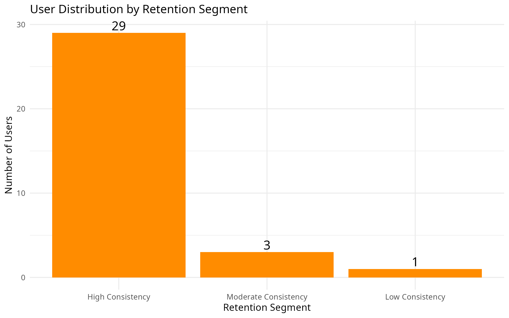
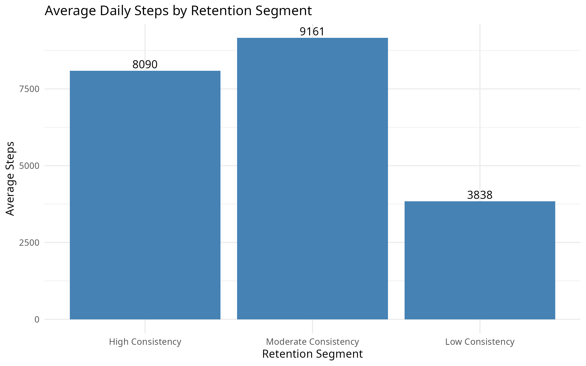
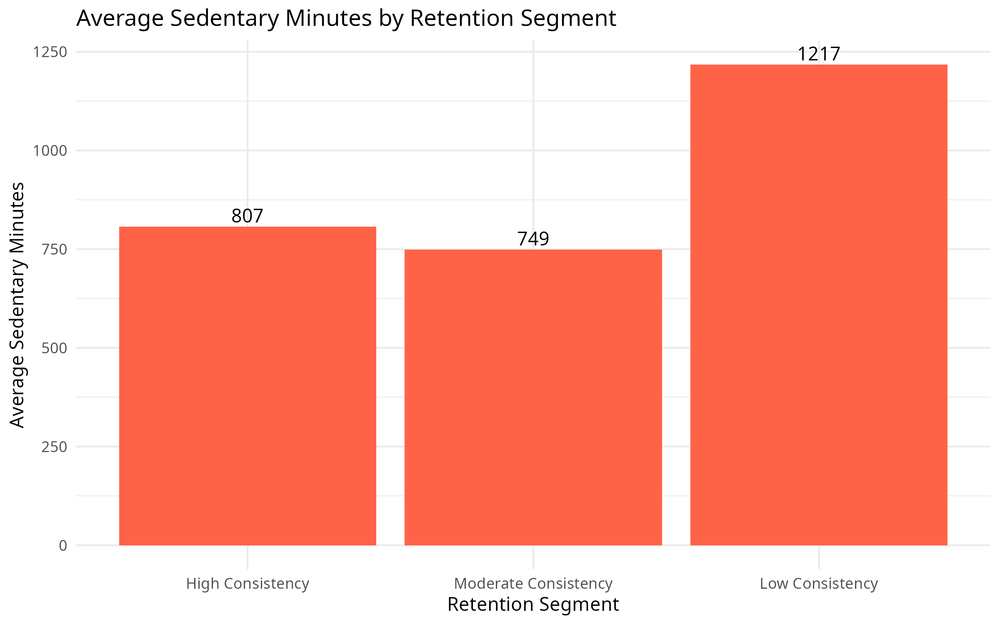
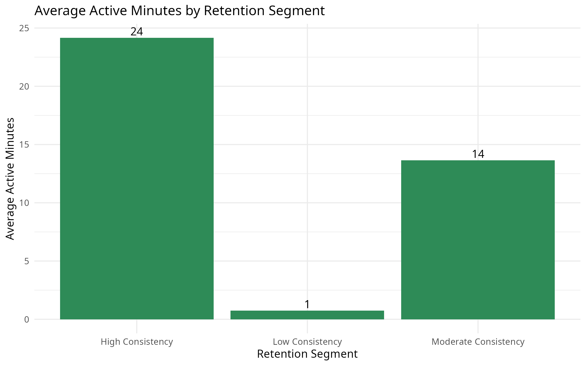

# Bellabeat Leaf Retention Analysis

## Business Problem

Bellabeat is a wellness technology company that produces smart devices designed to help women track health and lifestyle habits.

The objective of this analysis is to identify behavioral patterns among users who consistently track their activity and provide insights that can help improve long-term customer retention.

---

## Key Question

How can Bellabeat increase customer retention by understanding the behavior of consistently engaged users?

---

## Tools Used

- SQL (Google BigQuery)
- R (ggplot2, tidyverse)
- Google Sheets

---

## Dataset

Fitbit Fitness Tracker dataset from Kaggle.

Source:  
https://www.kaggle.com/datasets/arashnic/fitbit

The raw dataset was cleaned and transformed using SQL. The aggregated dataset used for visualization is included in this repository.

---

## Analysis Workflow

1. Data cleaning and transformation using SQL
2. Creation of a retention proxy using tracking consistency
3. User segmentation based on engagement level
4. Behavioral analysis across retention segments
5. Visualization of engagement patterns in R

---

## Key Visualizations

### User Distribution by Retention Segment

### Average Steps by Retention Segment

### Average Sedentary Minutes by Retention Segment

### Average Active Minutes by Retention Segment

---

## Key Insights

- High consistency users demonstrate significantly higher daily activity levels.
- Users who track consistently also exhibit lower sedentary behavior.
- Engagement appears strongly correlated with habit formation rather than random usage.

---

## Business Recommendations

- Introduce streak tracking features to reinforce consistent usage.
- Provide early onboarding challenges to encourage habit formation.
- Send activity reminders to users with declining tracking behavior.

